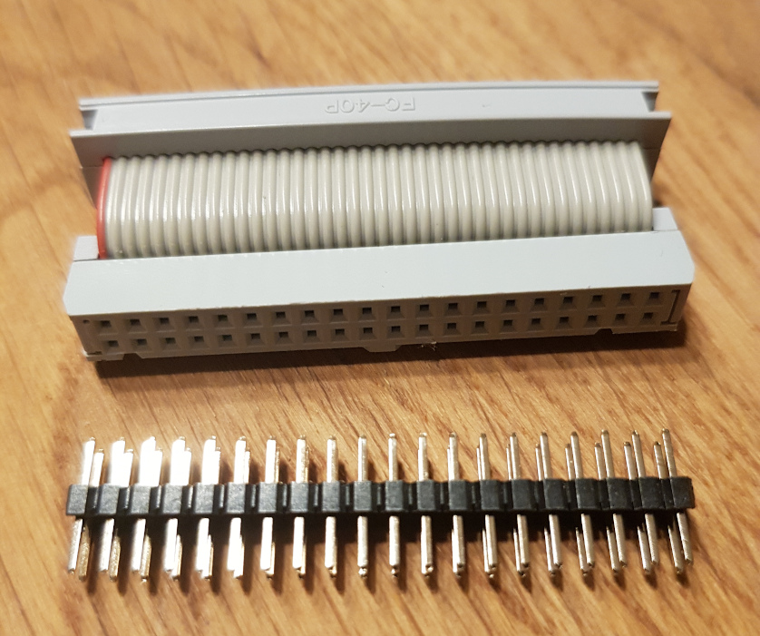
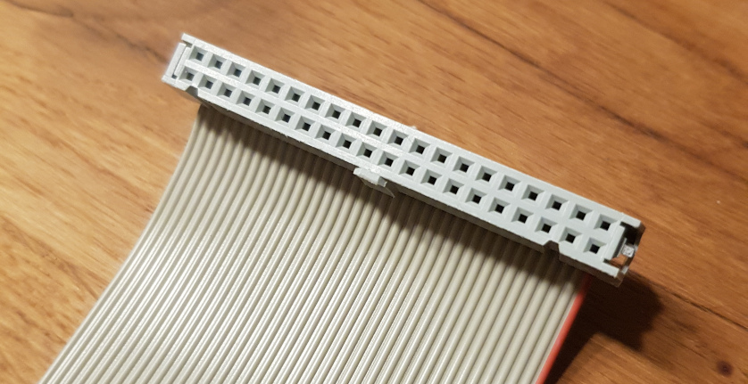
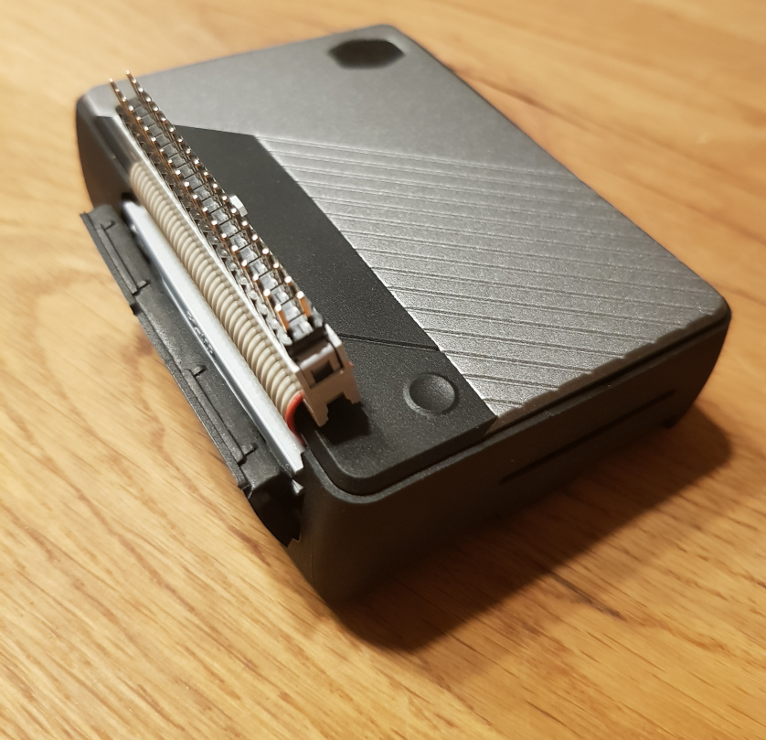
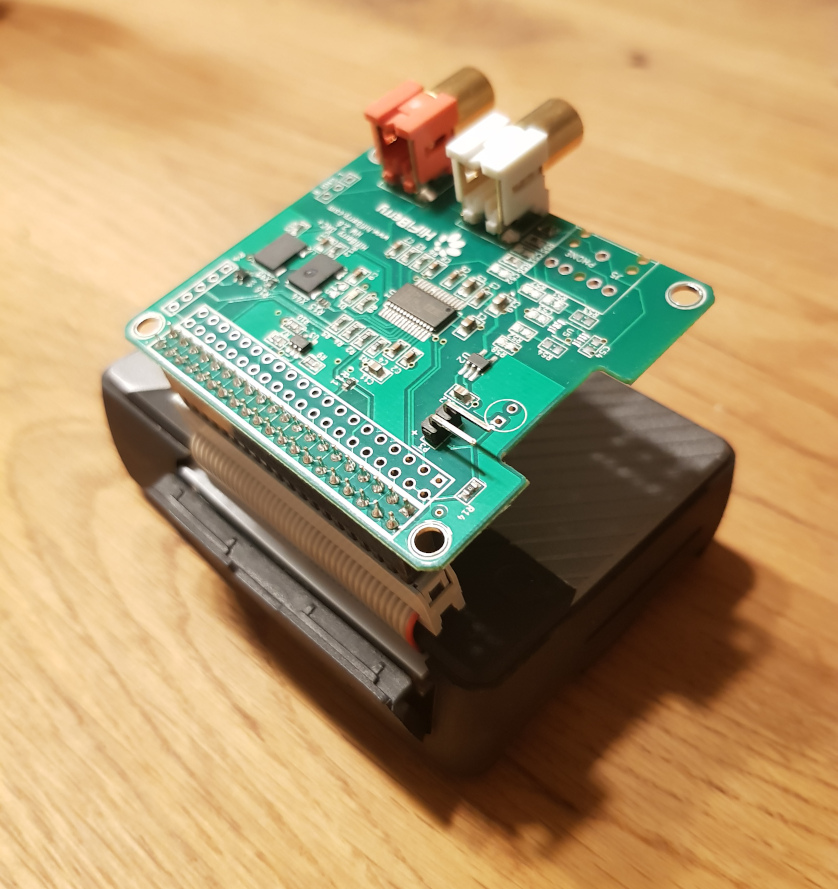

# PiCase40-GPIO

Fixing the GPIO rows order of Cooler Masters Pi Case 40.
KiCAD project for custom header pcb in `PiHeader`.

**NOT FULLY TESTED YET!**

## Guide for fixing with custom made ribbon cable

This is intended as fix **instead** of a custom PCB, so please don't try to combine both.

Overall you *only* need to get two things and stick them together:

On the top you see basically a plain female to female ribbon cable. Such are also often used for the RasPi T-Cobbler.
This specific version I've made myself to arrange the connectors on opposite sides and make it as short as possible, but a longer cable with connectors on the same side will also work.
Just note that the notch on the connector must be facing upwards when it is plugged into the Case40 for it to fit. So get a cable with one notch faced like below.

The second part you need is a male to male pinheader with (equally) **long pins on both sides**. Those pins should be at least 5.7mm in length on both sides. Spacing is 2.54mm and ofcourse you need 2x20 pins.
That sounds pretty simple, but as I discovered, it's hard to find and get. If you find distributors for this, please tell me.

A list of possible sources:
* [Aliexpress](https://www.aliexpress.com/item/33021895185.html)
* [Digikey](https://www.digikey.com/product-detail/en/sullins-connector-solutions/PRPC020DABN-RC/S2021EC-20-ND/2775919)
* [Kenable](https://www.kenable.co.uk/en/computer-cables-peripherals/ide-cables/1250-ide-pata-40-pin-40pin-coupler-adapter-male-pins-to-male-pins-001250-5055383412501.html) (also sells on amazon)
* [Schmartboard](https://schmartboard.com/qty-4-2-x-20-male-extra-long-headers-920-0198-01/)

If you fail to get one of those, try your luck on using two single row headers. Like these: [Aliexpress](https://www.aliexpress.com/item/32651418137.html)

After you managed to get those two parts you simply stick them together and one end into the header of your Pi Case40:

Afterwards you can use yours HATs aus usual! Just make sure not to plug in the HAT the wrong way around, especially if your plugs are facing the same direction.

## Quick evening update

I've recieved my ordered PCBs today and wanted to share a quick update:

As you can see the physical dimensions of the PCB are all correct and fit really well.

The pin header also is correct, but due to the missing spacing aligned to the bottom of the opening.
I've already successfully tested a small hack to add some spacing that worked very well and got the header to the center.
That is only applicable when assembling by hand though.

The button has a small offset to the right, that's something I'll fix in the layout soon. While this isn't affecting functionality there is another problem that does.
Without TPU the button works just fine, but otherwise it's to short to get pressed. That's because I didn't find one with 10.5mm in height, but used 9.6mm. Therefore here is also a spacing hack needed.
Besides that the operation force of the button I used seems to be to low. With TPU I barely get haptic feedback when pressing it. I've used `TL1105GF160Q` so I suggest to try `TL1105GF250Q` or something with an equally high actuation force.

I've soldered one version together and tried the fitting of the RasPi. In X and Y direction, there's no problem. The pin headers fit like a charm and even are easier to pull out then the original due to lower height.
Since I ordered a board with a thickness of 1.6mm for the first test, I still had to test if the cooler was in contact with the SoC. For this I used some plasticine.

As expected, the gap is a bit higher than with the original board, but even with just one thermal pad it might still work. 
To be on the safe side, I used two pads and with those I clearly felt the back pressure. On the left side, I couldn't even tighten the screws strongly to avoid bending the board.
