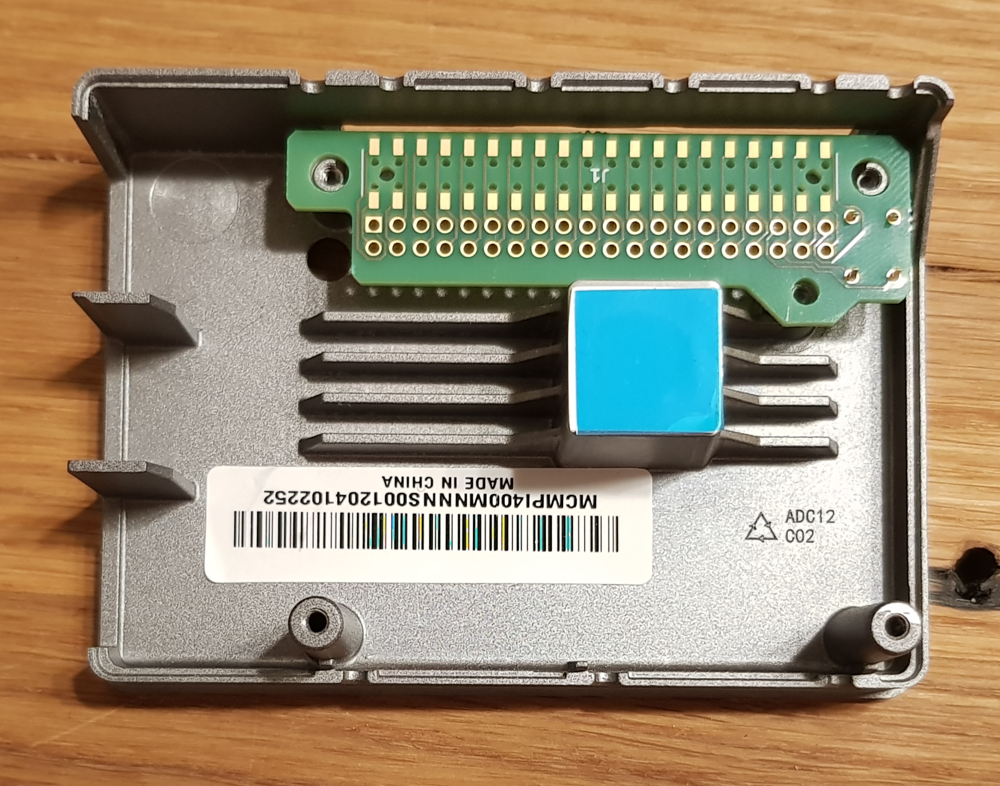
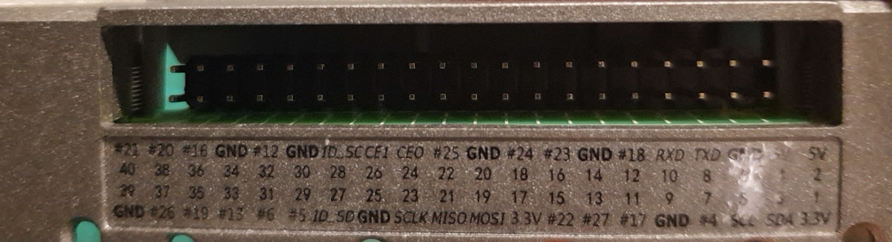
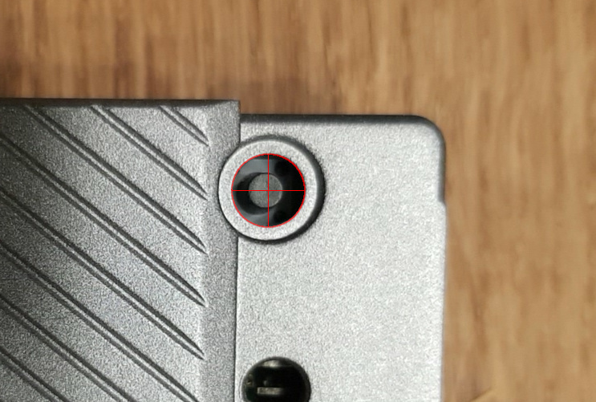
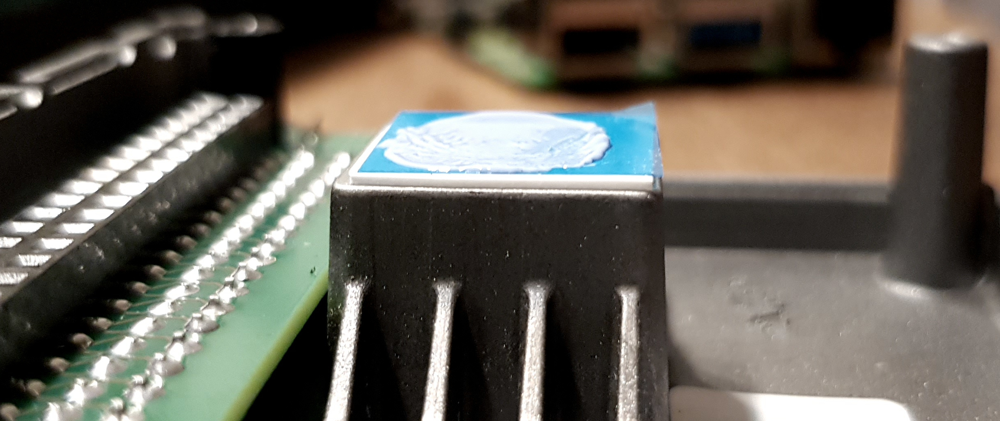
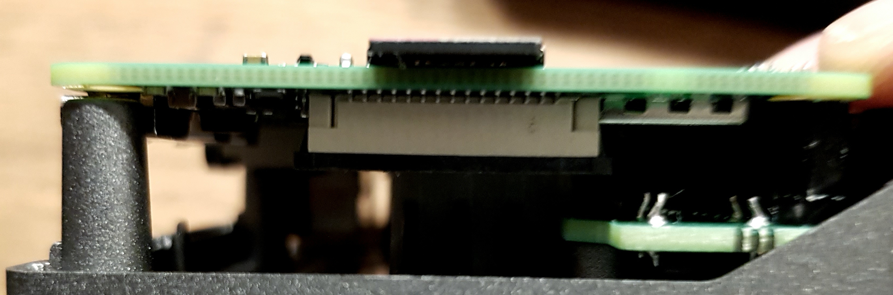

# PiCase40-GPIO

Fixing the GPIO rows order of Cooler Masters Pi Case 40.
KiCAD project for custom header pcb in `PiHeader`.

**NOT FULLY TESTED YET!**

## Quick evening update

I've recieved my ordered PCBs today and wanted to share a quick update:

As you can see the physical dimensions of the PCB are all correct and fit really well.

The pin header also is correct, but due to the missing spacing aligned to the bottom of the opening.
I've already successfully tested a small hack to add some spacing that worked very well and got the header to the center.
That is only applicable when assembling by hand though.

The button has a small offset to the right, that's something I'll fix in the layout soon. While this isn't affecting functionality there is another problem that does.
Without TPU the button works just fine, but otherwise it's to short to get pressed. That's because I didn't find one with 10.5mm in height, but used 9.6mm. Therefore here is also a spacing hack needed.
Besides that the operation force of the button I used seems to be to low. With TPU I barely get haptic feedback when pressing it. I've used `TL1105GF160Q` so I suggest to try `TL1105GF250Q` or something with an equally high actuation force.

I've soldered one version together and tried the fitting of the RasPi. In X and Y direction, there's no problem. The pin headers fit like a charm and even are easier to pull out then the original due to lower height.
Since I ordered a board with a thickness of 1.6mm for the first test, I still had to test if the cooler was in contact with the SoC. For this I used some plasticine.

As expected, the gap is a bit higher than with the original board, but even with just one thermal pad it might still work. 
To be on the safe side, I used two pads and with those I clearly felt the back pressure. On the left side, I couldn't even tighten the screws strongly to avoid bending the board.

## Coming soon: Quick guide for fixing with custom made ribbon cable.